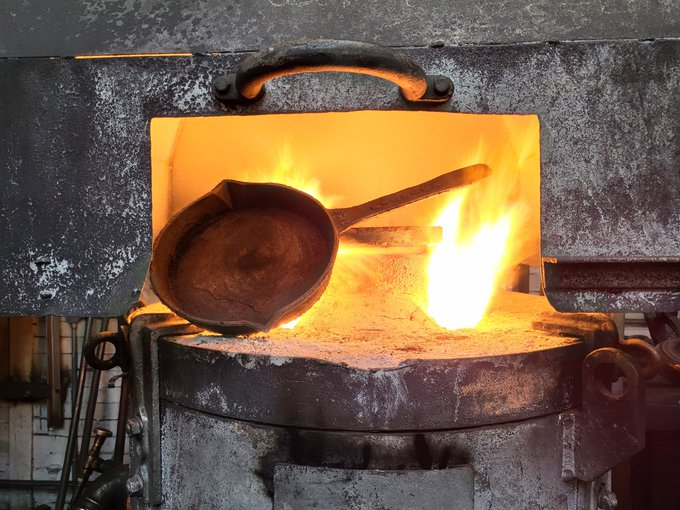

---
title: The process of making a new version
------

The romantic ideal of reconnecting now 2021 and then 1759 by making a cast iron frypan seemed like a solid way of celebrating Ironheart the collective achieveemsnt of the Falkirk area foundries and their International significance. TA number of factors encouraged further interest: The cast iron frypan can also still be used today, it suits all types of cookers. It has no potnetially unpleasant coatings; a patina, a non-stick surface, called seasoning layers of cooking oil built up with use; is also passed down the generatison as it never wears out; it can be made from recycled iron. 
How hard is it to make a cast iron frypan? initially it seemed simple just use an old pan as a pattern and get a local foundry to cast it. However the art of making thin castings is a hard won skill. At one time Falkirk speciallised in what is called light castings eg thin walled cast iron products like pots, pans, kettles, drain pipes, cooking ranges and bathtubs. Finding a foundry who was prepared to spend time reacquiring this skill was to prove a problem.    
Maecenas quis magna tellus. Aenean consectetur sem vel cursus vulputate. Fusce eros nisl, auctor ut vestibulum quis, interdum vel lectus. Donec hendrerit sed enim vel tempor. Integer eget pharetra erat, eget egestas lectus. Praesent fermentum, nibh ut tincidunt lacinia, magna nibh fermentum ex, quis rhoncus metus libero vitae augue. Sed sollicitudin quam a odio laoreet, eget euismod neque mollis. Proin nec turpis est. Integer quis felis ante. Vestibulum consectetur egestas urna nec congue. Mauris sapien neque, interdum id hendrerit eu, congue vel lacus. Nullam at elit non mauris venenatis ultrices.

Phasellus erat sapien, cursus eget lectus vitae, bibendum ultrices purus. Nulla tempus tempor nunc ut condimentum. Vestibulum consequat mauris commodo diam bibendum, in tempus arcu lobortis. Nullam felis nisl, ultricies sed pretium vel, tincidunt eget est. Praesent non felis at ligula varius ultricies sed nec nisl. Suspendisse facilisis velit vehicula purus porttitor, eget viverra augue viverra. Vivamus ultricies lacus vel consequat mollis. Nullam vitae justo a massa eleifend pulvinar. Suspendisse aliquam leo vitae tempor mollis.

Quisque tempor enim velit, a vestibulum quam malesuada at. Donec viverra sapien sit amet eros tristique malesuada. Sed maximus dignissim odio, in euismod massa vulputate ut. Phasellus consectetur nisl ut nulla finibus, et scelerisque mi bibendum. Praesent pellentesque mi in nunc vehicula, vitae convallis augue finibus. In sit amet urna justo. Fusce sapien orci, fermentum a imperdiet vitae, mattis id dolor.

Fusce eleifend lorem et tortor venenatis, faucibus faucibus sem tempus. Curabitur at tellus odio. Sed vitae pellentesque libero, non interdum mi. Donec est enim, commodo tristique nulla in, aliquam sollicitudin metus. Donec nunc sapien, facilisis et dui eu, sollicitudin laoreet erat. In interdum id augue non tincidunt. Aliquam luctus sodales enim eu vehicula.
